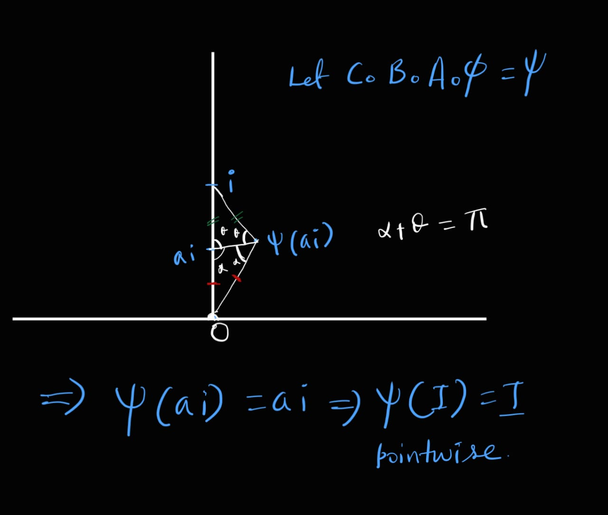

Let $\phi: \mathbb{H^2}\rightarrow \mathbb{H^2}$ be an isometry i.e. $\phi \in \operatorname{Isom}(\mathbb{H^2})$. Let also that $A \in PSL(2,\mathbb{R})$ such that $A\circ\phi(I)=I$ where $I$ is the imaginary axis minus $\{0\}$.Also let $B(z)=\frac{1}{\lambda}z \text{ }\forall z\in \mathbb{C}$ where $\lambda$ such that $A\circ\phi(i)=\lambda i$ for $i=\sqrt{-1}$. Then $B\circ A\circ \phi(i)=i$ and $B\circ A\circ \phi(I)=I$ as $B(I)=I$. Then we have $B\circ A \circ \phi$ preserves the $\{0,\infty\}$ and $i$ why? 

##### Reason: 
$B\in \operatorname{Isom}(\mathbb{H^2})$, hence $$B\circ A\circ \phi \in \operatorname{Isom}(\mathbb{H^2})$$
Hence $B\circ A\circ \phi$ is a continuous map from $\mathbb{H^2}$ to $\mathbb{H^2}$ hence we can extend it to the boundary of $\mathbb{H^2}$ i.e. $\mathbb{C}\cup\{\infty\}$. Hence $B\circ A\circ \phi$ preserves the $\{0,\infty\}$ and $i$.

---
Now, consider a map $C(z)=-\frac{1}{z}$, this map is an isometry of $\mathbb{H^2}$.

##### Reason:
Corresponidng matrix of $C$ is $$\begin{bmatrix} 0 & -1 \\\\ 1 & 0 \end{bmatrix}$$ which is in $PSL(2,\mathbb{R})$ and hence $C\in \operatorname{Isom}(\mathbb{H^2})$.

---
Now, $C\circ B\circ A\circ \phi(0)=0$ and $C\circ B\circ A\circ \phi(\infty)=\infty$ and $C\circ B\circ A\circ \phi(i)=i$ and hence $C\circ B\circ A\circ \phi(I)=I$.

##### Reason:

